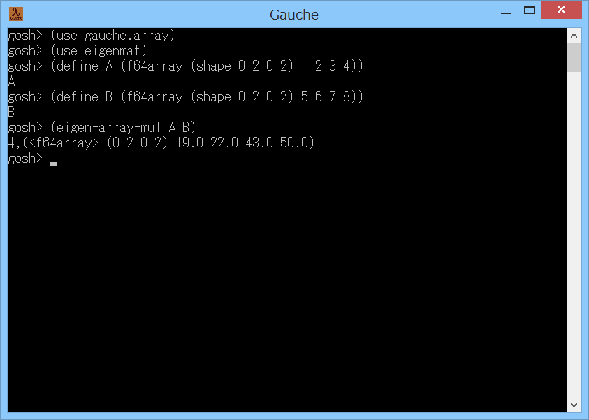

# eigenmat



## 概要
- Gauche で、Eigen ライブラリ を使って行列の高速演算を行うためのモジュールです。  
  Eigen は、C++ で書かれた線形代数用のライブラリです ( http://eigen.tuxfamily.org )。  
  現状、本モジュールは、標準の gauhce.array モジュールにおける  
  `<f64array>` クラスのごく一部の演算にのみ対応しています。


## インストール方法
1. Gauche のインストール  
   事前に Gauche がインストールされている必要があります。  
   Windows の場合は、以下のページに Windows用バイナリインストーラ があるので  
   インストールを実施ください。  
   http://practical-scheme.net/gauche/download-j.html  
   (すでにインストール済みであれば本手順は不要です)

2. 開発環境のインストール  
   C/C++ の開発環境が必要です。  
   Windows の場合は、以下のページを参考に、MSYS2/MinGW-w64 (64bit/32bit) の  
   開発環境をインストールしてください。  
   https://gist.github.com/Hamayama/eb4b4824ada3ac71beee0c9bb5fa546d  
   (すでにインストール済みであれば本手順は不要です)

3. Eigen ライブラリのインストール  
   Eigen のホームページ ( http://eigen.tuxfamily.org ) から、  
   ソース (zipファイル等) を取得して、適当なフォルダに展開してください。  
   そして、中の Eigen フォルダを、  
   開発環境のインクルードフォルダにコピーしてください。  
   Windows の場合は、  
   C:\msys64\mingw64\include にコピーしてください。  
   (32bit環境の場合には、64 の部分を 32 に読み替えてください)

4. ファイルのダウンロード  
   本サイト ( https://github.com/Hamayama/eigenmat ) のソースを、  
   (Download Zip ボタン等で) ダウンロードして、作業用のフォルダに展開してください。  
   例えば、作業用のフォルダを c:\work とすると、  
   c:\work\eigenmat の下にファイル一式が配置されるように展開してください。  
   (注意) 作業用フォルダのパスには、空白を入れないようにしてください。

5. コンパイルとインストール  
   展開したフォルダで、./configure と make install を実行して、  
   インストールを実施ください。  
   Windows の場合は、以下のように実行してください。  
   ＜MSYS2/MinGW-w64 (64bit) 環境の場合＞  
   プログラムメニューから MSYS2 の MinGW 64bit Shell を起動して、以下のコマンドを実行します。  
   ＜MSYS2/MinGW-w64 (32bit) 環境の場合＞  
   プログラムメニューから MSYS2 の MinGW 32bit Shell を起動して、以下のコマンドを実行します。  
   ( c:\work にソースを展開した場合)
   ```
     cd /c/work/eigenmat
     ./configure   # Makefile等を生成します
     make          # コンパイルを実行します
     make install  # Gaucheのライブラリフォルダにインストールします
     make check    # テストを実行します
   ```
   (注意) Windows の環境によっては make install を実行すると、  
   「*** ERROR: mkstemp failed」というエラーが発生します。  
   このエラーは c:\Program Files (x86) のフォルダに 書き込み権限がないとき等に発生します。  
   その場合には、プログラムメニューからの開発環境の起動時に右クリックして、  
   「管理者として実行」を選択してください。  
   そして再度上記のコマンドを実行してください。

- 以上です。


## 使い方
- 基本的な使い方は、以下のようになります。
  ```
    (use gauche.array) ; 標準の行列演算モジュールをロードします。
    (use eigenmat)     ; 本モジュールをロードします。
    (define A (f64array (shape 0 2 0 2) 1 2 3 4)) ; 2x2 の 行列A を作成します。
    (define B (f64array (shape 0 2 0 2) 5 6 7 8)) ; 2x2 の 行列B を作成します。
    (print (eigen-array-mul A B)) ; 行列A と 行列B の積を計算して表示します。
  ```
- 現状、本モジュールは、標準の gauhce.array モジュールにおける  
  `<f64array>` クラスの以下の演算にのみ対応しています。
  - `(eigen-array-nearly=? A B [abs-tol])`  
    行列A と 行列B の各要素がほぼ等しければ #t を返します。  
    そうでなければ #f を返します。  
    abs-tol には、許容誤差の絶対値を指定します。  
    abs-tol は省略可能です。省略した場合は 1e-4 を指定したことになります。
  - `(eigen-array-mul A B)`  
    行列A と 行列B の積を計算して返します。
  - `(eigen-array-determinant A)`  
    行列A の行列式を計算して返します。
  - `(eigen-array-inverse A [abs-tol])`  
    行列A の逆行列を計算して返します。  
    ただし、行列A の行列式の絶対値が abs-tol 以下だった場合は #f を返します。  
    abs-tol は省略可能です。省略した場合は 1e-4 を指定したことになります。
  - `(eigen-array-solve A B [abs-tol])`  
    AX=B となる 行列X を計算して返します。  
    ただし、行列A の行列式の絶対値が abs-tol 以下だった場合は #f を返します。  
    abs-tol は省略可能です。省略した場合は 1e-4 を指定したことになります。


## 注意事項
1. 本モジュールは、標準の gauche.array モジュールにおける  
   `<f64array>` クラスの内部情報 (backing-storage スロット) を使用しています。  
   このため、Gauche の将来の変更で動作しなくなる可能性があります。


## 環境等
- OS
  - Windows 8.1 (64bit)
- 環境
  - MSYS2/MinGW-w64 (64bit/32bit) (gcc version 7.3.0 (Rev2, Built by MSYS2 project))
- 言語
  - Gauche v0.9.6
- ライブラリ
  - Eigen v3.3.5


## 履歴
- 2018-8-13  v1.00 (初版)
- 2018-8-13  v1.01 コメント修正のみ


(2018-8-13)
